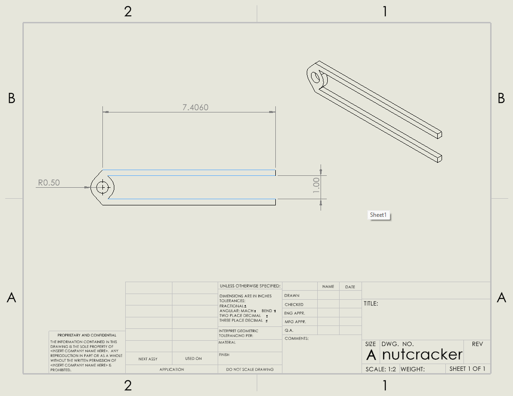

Problem Statement:
A nutcracker must be deisgned to allow a human to crack macadamia nuts. 

Constraints and Input parameters:
Macadamia nuts have  some of the most difficult shells to crack, with an average breaking force of 222.18kg (source: https://doi.org/10.1007/s10071-007-0131-2). While humans have a wide range of grip strengths, I have chosen to design for a human with a 30kg grip strength.

Approach to problem:
I decided to make the nutcracker mechanically very simple to allow easy manufacturing and assembly. The desing uses a large bearing to connect two simple rods. The nut is placed as close to the pivot as possible to maximize mechanical advantage.

Diagram:

Usability:
Providing a mechanical advantage of 7.406, the nutcracker allows a human with a grip strength of 30kg to crack a macadamia nut with one hand, and a human with a grip strength of 15kg to do the same with two hands. While this design is very simple to manufacture, and should be a cheap solution with minimal machining required, it will not be the most comfortable design to use. A rubber overmolded grip or more ergonomically contoured handles would greatly improve this aspect of the design. 